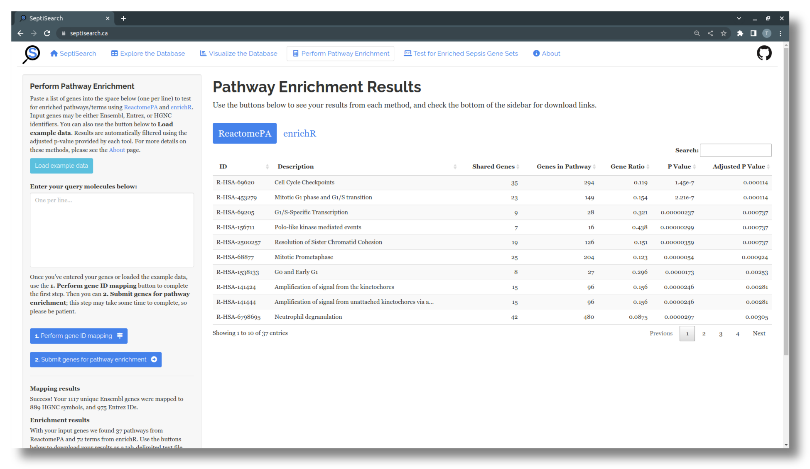

# Perform Pathway Enrichment

## Overview
SeptiSearch includes the ability to upload any list of genes (e.g. those
identified as differentially expressed in an RNA-Seq experiment) and test them
for enriched Reactome pathways using [ReactomePA](https://bioconductor.org/packages/ReactomePA),
as well as MSigDB's Hallmark gene sets and GO terms via [enrichR](https://cran.r-project.org/package=enrichR).
This functionality is designed to complement the use of GSVA (the next tab), 
which tests your data for the dysregulation of the curated sepsis gene sets.

## Supported input types
You have a few options for submitting data to SeptiSearch for pathway enrichment:

1. Use the "Load example data" button to load a preselected list of genes
2. Paste your own list of genes into the input field as a single column, with
one gene per line
  - Submitted genes IDs can be Ensembl, Entrez, or HGNC names; the ID type is
  automatically detected, and mapping is performed as needed
3. From the [Explore the Database](explore) tab, select a single gene set in the
top table, then use the "Test this gene set for enriched pathways" button to
send the genes to the Enrichment tab

## Running pathway enrichment
Once you've added genes via one of the above methods, you can proceed with the
next steps to test your genes:

- The "1. Perform gene ID mapping" button will now be enabled, which will
  complete any necessary mapping steps prior to enrichment testing
- A confirmation message will appear to confirm your genes have been mapped; 
  click "OK" or anywhere outside the popup to dismiss it
- When the ID mapping is completed, you can then press the "2. Submit genes for
  pathway enrichment" button to run the enrichment tests
- Depending on the number of genes uploaded, this may take up to 30 seconds to
  complete - please be patient!

Your results will be displayed in two tables; one containing Reactome pathways
identified by ReactomePA, and the second containing GO terms and MSigDB
Hallmark gene sets found by enrichR. You can use the buttons to switch between
the two tables. If you're unsure what any of the columns mean, hover your
cursor over the column names to see a brief description. Both tables can be
then downloaded using the buttons at the bottom of the sidebar.

