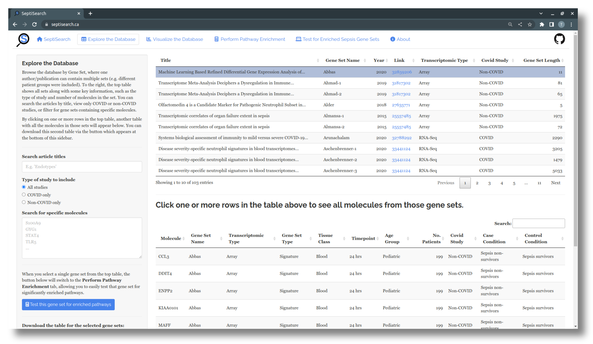
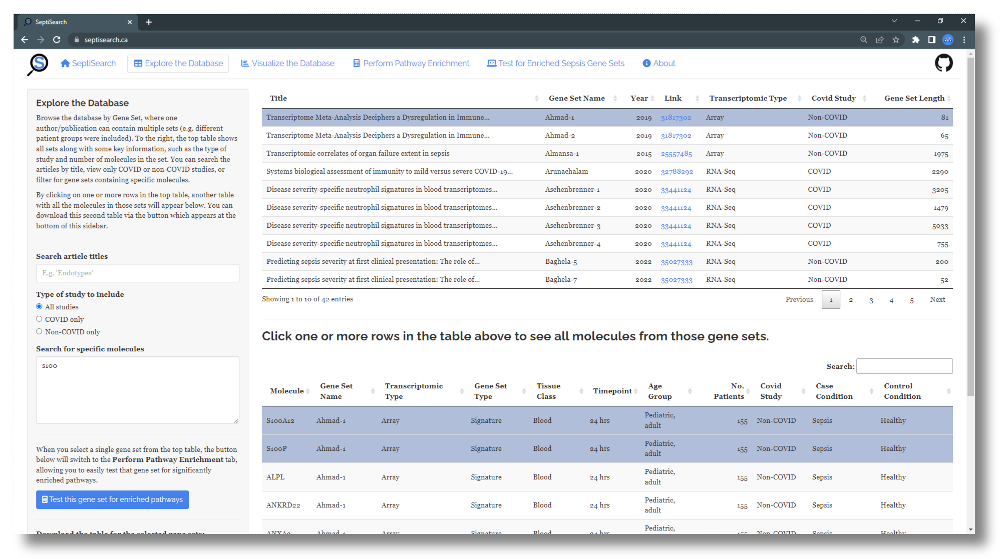
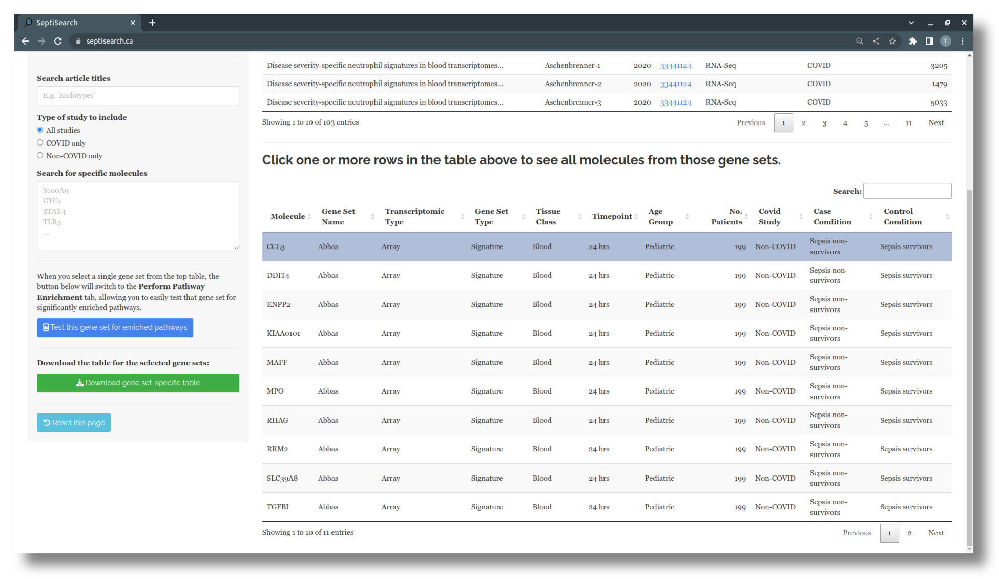

# Explore the Database

## Overview
This tab allows you to easily browse and search the SeptiSearch database.
Entries are organized by Gene Set Name, which is a unique identifier given to a
set of genes curated from the literature. Initially, the table on the right
lists all Gene Sets, along with a few pieces of key information on
each, and links to the original publication.

{: .note }
One publication may have multiple gene sets when multiple comparisons or datasets are included, e.g. comparing two sepsis severity groups to healthy controls. This is denoted with a numeric suffix, e.g. "Ahmad-1" and "Ahmad-2."

Clicking on one or more rows in this table will bring up a second table below
the first, listing all molecules in the selected gene set(s) and more detailed
information about the set. A small search box at the top right corner of the 
second table can be used to look for specific conditions or molecules in the 
selected set(s).

## Searching and filtering the database
The left sidebar presents a number of options for searching and filtering the 
SeptiSearch database using input fields described below.

- The first field in the sidebar is used to search the entries based on the
  title of publication. For example, you could enter "endotypes" to look at
  publications which focus on characterizing sepsis disease endotypes
- With the second field you can restrict the displayed gene sets based on the
  inclusion of COVID patients
- Use the large test field to search for specific molecules in the database
  - This search is case-insensitive, and will return partial matches. For
  example, typing "s100" would return gene sets which contain "S100A9",
  "S100A12", etc.
  - After searching for a specific molecule, clicking on any row(s) in the
  top table will highlight and display any matching molecules at the top of the
  second table

{: .note }
After entering a number of searches or filter criteria, if you would like to return to the original/complete table, click the "Reset this page" button at the bottom of the sidebar, which will reset all inputs. In some cases it may also help to refresh the page from your browser (CTRL+F5).

## Perform pathway enrichment on SeptiSearch gene sets
If you select a single gene set in the top table, a button in the left sidebar
is enabled which will send that gene set to the "Perform Pathway Enrichment"
tab, allowing you to easily test a gene set of interest for enriched pathways.
For more details, see [this section](enrich) performing pathway enrichment in
SeptiSearch.

## Downloading data from SeptiSearch
When you have selected one or more rows from the top table, you can use the
provided button at the bottom of the left sidebar to download the second table
as a tab-delimited file.
