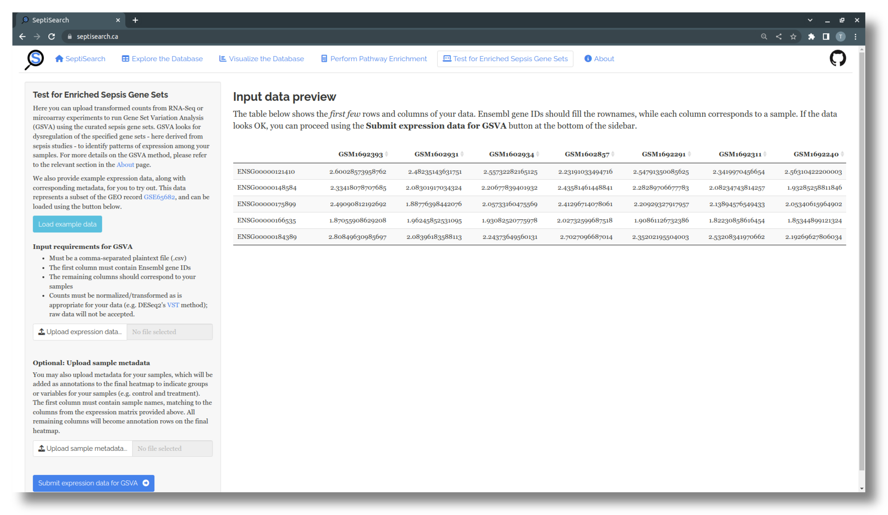
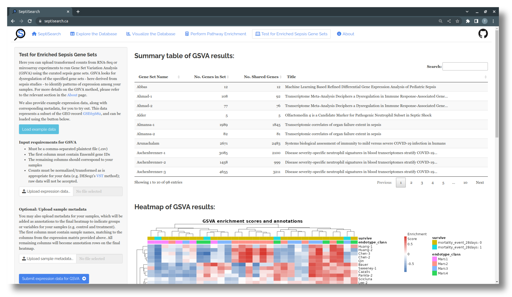

# Test for Enriched Sepsis Gene Sets

## Overview
SeptiSearch provides an implementation of [GSVA](https://github.com/rcastelo/GSVA),
which will examine the expression of its curated gene sets within user-supplied
expression data produced by technologies such as RNA-Seq or microarrays. Each
sample within your dataset is assigned an enrichment score for each gene set,
which can be positive or negative depending on the expression level of the genes
in a given sample.

## Getting started
There are two options for submitting data to be analyzed with GSVA:

1. Included with SeptiSearch is an example dataset based on microarray data from
[GSE65682](https://www.ncbi.nlm.nih.gov/geo/query/acc.cgi?acc=GSE65682),
accessible via the "Load example data" button
2. Upload your own expression dataset to analyze

If you'd like to submit your own data for GSVA, the expression component needs
to meet the following criteria:

- The data must in a plain text, comma-delimited (CSV) file
- The first column must contain Ensembl gene IDs
- The remaining columns should contain samples, each with a unique name
- Expression values within the matrix should be transformed/normalized
  - We provide a link to information on the Variance Stabilized Transformation
  (VST), which is often suitable for RNA-Seq data, but other methods may also be
  used, e.g. if you're working with microarrary data

Whichever option you choose, a preview of the uploaded data will be displayed
to confirm the data has been processed correctly.

## Uploading metadata along with expression data
While you can submit only the expression data for GSVA, it's recommended to also
include metadata (e.g. sample groupings) to make the final heatmap more
informative. While the example dataset already includes some associated 
metadata, you'll need to supply your own when using your expression data. This
metadata must meet a few requirements:

- Your metadata must be in a plain text, comma-delimited (CSV) file
- The first column should contain the sample names, which must match the sample
  names (i.e. column names) from your expression data
	- Any missing, extra, or non-matching sample names will cause an error, and
  this matching is case-sensitive
- All remaining columns will be treated as variables or traits of the samples,
  e.g. disease status, severity, mortality, etc.

## Viewing & saving your results
Once you've loaded the example data, or uploaded your expression data alone or
with metadata, select "Submit expression data for GSVA" to run the analysis and
view the results, which include a summary table and heatmap.

{: .note }
Depending on how many samples your data contains, running GSVA may take up to 30 seconds to complete; please be patient!

The top table contains a brief summary of your results, indicating for each gene
set the total and shareed number of genes, and the title of the associated
publication. More detailed explanations of all columns can be viewed by
hovering over the column names with your cursor.

A heatmap is automatically generated to visualize the GSVA results. Columns
correspond to samples, while each row represents a gene set in SeptiSearch. The
central area of the heatmap displays the enrichment score for each sample/gene
set combination, indicating the level of expression of the constituent genes in
a given sample. This score can be positive (red) or negative (blue), and ranges
from one to negative one. 

A full results table can be downloaded with the button at the bottom of the
sidebar, and the image can be saved by right-clicking on it and selecting "Save
Image..." from the context menu.
