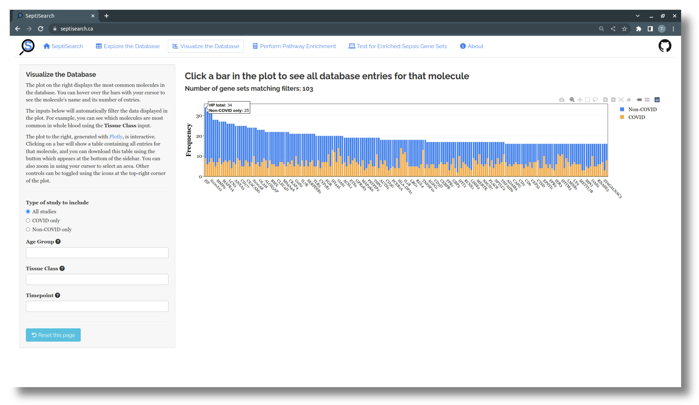
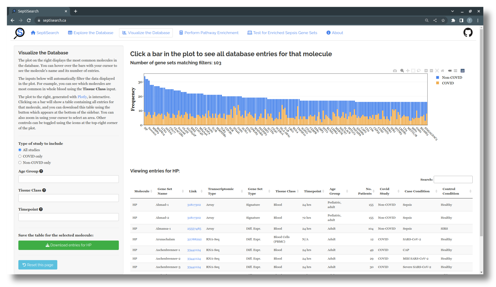

# Visualize the Database

## Overview
This tab provides a way to visualize SeptiSearch's curated gene sets, with
a greater focus on which molecules frequently occur within the database.

## Interacting with the plot
The plot that appears shows the most common molecules in the database, coloured
by COVID status, with the sidebar on the left providing a number of ways to
filter the data. This plot, made with [plotly](https://plotly.com/r/), is 
interactive in a number of ways:

- Hovering over any bar with your cursor will display the molecule's name and 
  both its total number of occurences, and occurrences by COVID status
- Click-and-drag from side-to-side to zoom in on a region of the x-axis
- At the top right of the plot there are a number of additional controls you can
  use

- Additionally, you can click on a bar in the plot to bring up a table below
which lists all entries for that molecule in SeptiSearch.

## Filtering the data
The sidebar contains a number of input fields you can use to refine what data is
included in the visualization.

- The first lets you include only COVID or non-COVID related studies, and will
  show only the corresponding molecules based on their gene set
- The next three fields will filter the data based on the assigned Age Group,
  Tissue Class, and Timepoint
  - These three options can be combined in any way you like
  - More than one option can be chosen for each field, e.g. you can see what the
  	top molecules are for Adults, in any type of Blooc Cell using the Age Group
  	and Tissue Class input
  - Check SeptiSearch's About page (the last tab listed at the top of the page)
    for more details on these labels and how they're defined

{: .note }
You can use the "Reset this page" button at the bottom of the sidebar to restore the plot and all filters to their original state.
