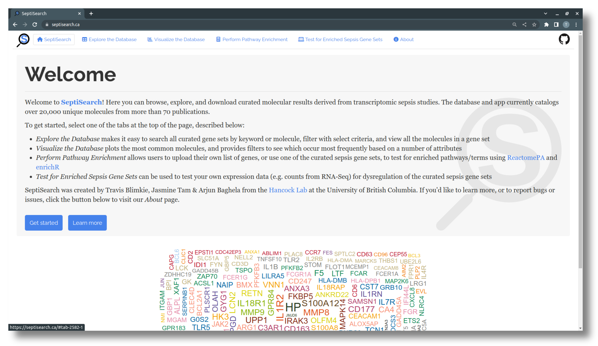

# Welcome to the SeptiSearch tutorial pages
{: .fs-9 }

SeptiSearch is an interactive Shiny app providing access to manually-curated molecular sepsis data from current publications.
{: .fs-6 .fw-300 }

[Visit septisearch.ca](https://septisearch.ca){: .btn .btn-primary .fs-5 .mb-4 .mb-md-0 .mr-2 }
[Go to the GitHub page](https://github.com/hancockinformatics/SeptiSearch){: .btn .fs-5 .mb-4 .mb-md-0 }

***

The sidebar on the left contains a section for each tab in SeptiSearch, plus a *General Troubleshooting* page for non-specific questions or issues.

